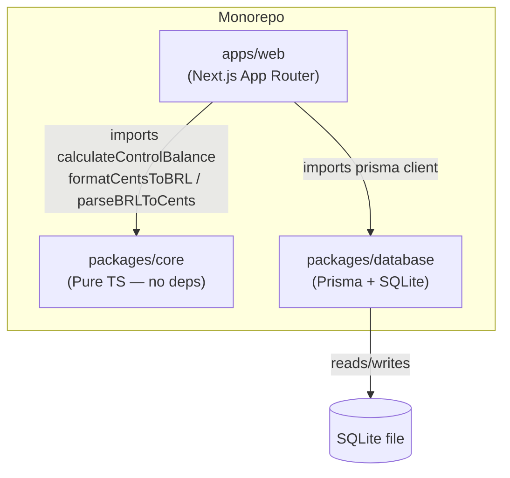

# Design Document: Sistema Maré

## Overview

Sistema Maré is a personal finance control system for two users (owner and their mother). It tracks monthly "controls" — financial trackers that compute an expected balance from a starting value, a daily step, and the current day of the month. There is no authentication, no transaction history, and no complex infrastructure.

The system is a **pnpm workspaces monorepo** with three packages:

| Package | Path | Responsibility |
|---|---|---|
| `core` | `packages/core` | Pure business logic: balance calculation, money formatting/parsing |
| `database` | `packages/database` | Prisma schema, SQLite client export |
| `web` | `apps/web` | Next.js App Router UI, server actions, pages |

The design intentionally avoids over-engineering. No Docker, no auth, no microservices, no separate API layer — just a Next.js app that reads/writes a local SQLite file through Prisma and imports shared logic from the core package.

---

## Architecture



Data flow for a page load:

1. Next.js Server Component calls `prisma.control.findMany()` (imported from `packages/database`).
2. For each control, it calls `calculateControlBalance(...)` (imported from `packages/core`).
3. It calls `formatCentsToBRL(...)` (also from `packages/core`) to render monetary values.
4. The rendered HTML is streamed to the browser.

Mutations (create, update, delete) are handled by **Next.js Server Actions** — no separate API routes needed.

---

## Components and Interfaces

### `packages/core`

#### `calculateControlBalance`

```typescript
function calculateControlBalance(params: {
  baseValueCents: number;
  dailyStepCents: number;
  type: "INCREASE" | "DECREASE";
  dayOfMonth?: number;
  date?: Date;
}): number
```

Priority for day resolution: `dayOfMonth` > `date.getDate()` > `new Date().getDate()`.

Formula:
- `INCREASE`: `baseValueCents + dailyStepCents * dayOfMonth`
- `DECREASE`: `baseValueCents - dailyStepCents * dayOfMonth`

#### `formatCentsToBRL`

```typescript
function formatCentsToBRL(cents: number): string
// 100000 → "R$ 1.000,00"
```

Uses `Intl.NumberFormat` with `locale: "pt-BR"`, `style: "currency"`, `currency: "BRL"`.

#### `parseBRLToCents`

```typescript
function parseBRLToCents(value: string): number
// "1.000,00" → 100000
// "1000,00"  → 100000
// "1000"     → 100000
```

Parsing strategy:
1. Strip currency symbol and whitespace.
2. If the string contains a comma, treat it as a decimal separator (Brazilian format): remove thousands dots, replace comma with dot, parse as float, multiply by 100.
3. If the string is a plain integer string (no comma), multiply by 100.

#### `types.ts`

```typescript
export type ControlType = "INCREASE" | "DECREASE";

export interface Control {
  id: string;
  name: string;
  baseValueCents: number;
  type: ControlType;
  dailyStepCents: number;
  createdAt: Date;
  updatedAt: Date;
}
```

#### `index.ts`

Re-exports all public symbols from the package.

---

### `packages/database`

#### `prisma/schema.prisma`

```prisma
datasource db {
  provider = "sqlite"
  url      = env("DATABASE_URL")
}

generator client {
  provider = "prisma-client-js"
}

model Control {
  id             String      @id @default(cuid())
  name           String
  baseValueCents Int
  type           ControlType
  dailyStepCents Int
  createdAt      DateTime    @default(now())
  updatedAt      DateTime    @updatedAt
}

enum ControlType {
  INCREASE
  DECREASE
}
```

#### `src/client.ts`

```typescript
import { PrismaClient } from "@prisma/client";

const globalForPrisma = globalThis as unknown as { prisma: PrismaClient };

export const prisma =
  globalForPrisma.prisma ?? new PrismaClient();

if (process.env.NODE_ENV !== "production") {
  globalForPrisma.prisma = prisma;
}
```

The singleton pattern prevents multiple client instances during Next.js hot-reload in development.

---

### `apps/web`

#### Pages and Routes

| Route | Component | Description |
|---|---|---|
| `/controls` | `app/controls/page.tsx` | List all controls with calculated balances |
| `/controls/new` | `app/controls/new/page.tsx` | Create control form |
| `/controls/[id]` | `app/controls/[id]/page.tsx` | Control detail view |
| `/controls/[id]/edit` | `app/controls/[id]/edit/page.tsx` | Edit control form |

#### Server Actions (`app/controls/actions.ts`)

```typescript
async function createControl(data: CreateControlInput): Promise<void>
async function updateControl(id: string, data: UpdateControlInput): Promise<void>
async function deleteControl(id: string): Promise<void>
```

All actions use `revalidatePath` and `redirect` from `next/navigation` after mutations.

#### `ControlForm` Component (`components/ControlForm.tsx`)

Shared form used by both create and edit pages. Props:

```typescript
interface ControlFormProps {
  defaultValues?: Partial<ControlFormValues>;
  onSubmit: (data: ControlFormValues) => Promise<void>;
}
```

Uses React Hook Form with a Zod schema for validation. Money fields accept Brazilian format strings and are converted to cents via `parseBRLToCents` before submission.

#### Zod Schema (`lib/schemas.ts`)

```typescript
const controlSchema = z.object({
  name: z.string().min(1, "Nome é obrigatório"),
  baseValue: z.string().min(1, "Valor base é obrigatório"),
  type: z.enum(["INCREASE", "DECREASE"], { required_error: "Tipo é obrigatório" }),
  dailyStep: z.string().refine(
    (v) => parseBRLToCents(v) > 0,
    "Passo diário deve ser maior que zero"
  ),
});
```

#### Layout (`app/layout.tsx`)

Wraps all pages with a MUI `AppBar` containing the title "Sistema Maré" and a navigation link to `/controls`.

---

## Data Models

### Control (Prisma / SQLite)

| Field | Type | Constraints | Notes |
|---|---|---|---|
| `id` | `String` | PK, CUID | Auto-generated |
| `name` | `String` | NOT NULL | Display name |
| `baseValueCents` | `Int` | NOT NULL | Starting balance in cents |
| `type` | `ControlType` | NOT NULL | `INCREASE` or `DECREASE` |
| `dailyStepCents` | `Int` | NOT NULL, > 0 | Daily change in cents (always positive) |
| `createdAt` | `DateTime` | NOT NULL | Auto-set on creation |
| `updatedAt` | `DateTime` | NOT NULL | Auto-updated on change |

### ControlFormValues (Client-side)

| Field | Type | Notes |
|---|---|---|
| `name` | `string` | Raw text input |
| `baseValue` | `string` | BRL-formatted string, e.g. `"1.000,00"` |
| `type` | `"INCREASE" \| "DECREASE"` | Select value |
| `dailyStep` | `string` | BRL-formatted string, e.g. `"35,00"` |

Money fields are stored as strings in the form and converted to cents only at submission time.

### Calculated Balance (Derived, not persisted)

| Field | Type | Notes |
|---|---|---|
| `calculatedBalanceCents` | `number` | Result of `calculateControlBalance(...)` |
| `calculatedBalanceBRL` | `string` | Result of `formatCentsToBRL(calculatedBalanceCents)` |

---

## Correctness Properties

*A property is a characteristic or behavior that should hold true across all valid executions of a system — essentially, a formal statement about what the system should do. Properties serve as the bridge between human-readable specifications and machine-verifiable correctness guarantees.*

### Property 1: Money formatting/parsing round-trip

*For any* non-negative integer cent value `c`, parsing the BRL-formatted string back to cents must return the original value: `parseBRLToCents(formatCentsToBRL(c)) === c`.

**Validates: Requirements 3.5**

---

### Property 2: BRL format output is well-formed

*For any* non-negative integer cent value, `formatCentsToBRL` must return a string that starts with `"R$"`, uses a dot as the thousands separator, and uses a comma as the decimal separator.

**Validates: Requirements 3.1**

---

### Property 3: Plain integer string parsing

*For any* positive integer `n`, `parseBRLToCents(String(n))` must return `n * 100`.

**Validates: Requirements 3.3**

---

### Property 4: DECREASE balance formula

*For any* non-negative `baseValueCents`, positive `dailyStepCents`, and `dayOfMonth` in [1, 31], `calculateControlBalance` with `type = "DECREASE"` must return exactly `baseValueCents - dailyStepCents * dayOfMonth`.

**Validates: Requirements 2.6, 11.2**

---

### Property 5: INCREASE balance formula

*For any* non-negative `baseValueCents`, positive `dailyStepCents`, and `dayOfMonth` in [1, 31], `calculateControlBalance` with `type = "INCREASE"` must return exactly `baseValueCents + dailyStepCents * dayOfMonth`.

**Validates: Requirements 2.5, 11.3**

---

### Property 6: Day-of-month resolution priority

*For any* `dayOfMonth` value, any `Date` object, any `baseValueCents`, `dailyStepCents`, and `type`, calling `calculateControlBalance` with both `dayOfMonth` and `date` must produce the same result as calling it with only `dayOfMonth` — i.e., `dayOfMonth` always takes precedence over `date`.

**Validates: Requirements 2.2, 2.3**

---

### Property 7: Non-positive daily step values are rejected by validation

*For any* integer value ≤ 0 used as the `dailyStep` input, the Zod validation schema must reject it and return a validation error.

**Validates: Requirements 5.5**

---

## Error Handling

### Not-Found Controls

When a route like `/controls/[id]` or `/controls/[id]/edit` is accessed with a non-existent ID, the server component calls Next.js's `notFound()` function, which renders the nearest `not-found.tsx` boundary. This satisfies Requirements 6.8 and 7.4.

### Form Validation Errors

Zod validation errors are surfaced through React Hook Form's `formState.errors` object and displayed inline next to each field using MUI `FormHelperText`. The form is not submitted to the server action if client-side validation fails.

### Server Action Errors

Server actions are wrapped in try/catch. On database errors, a user-visible error message is returned and displayed via a MUI `Alert` component. Redirects only happen on success.

### Prisma Client Initialization

The singleton pattern in `packages/database/src/client.ts` prevents "too many connections" errors during Next.js development hot-reload.

---

## Testing Strategy

### Unit Tests (Vitest — `packages/core`)

The core package is pure TypeScript with no I/O, making it ideal for both example-based and property-based tests.

**Example-based tests** (`calculate-control-balance.test.ts`):
- DECREASE: `baseValueCents=100000, dailyStepCents=3500, dayOfMonth=5` → `82500`
- INCREASE: `baseValueCents=0, dailyStepCents=10000, dayOfMonth=10` → `100000`
- Date object representing day 15 is used correctly
- Day 1 edge case
- Non-zero base value with INCREASE

**Example-based tests** (`money.test.ts`):
- `formatCentsToBRL(100000)` → `"R$ 1.000,00"`
- `parseBRLToCents("1000")` → `100000`
- `parseBRLToCents("1000,00")` → `100000`
- `parseBRLToCents("1.000,00")` → `100000`

### Property-Based Tests (Vitest + fast-check — `packages/core`)

Property-based testing is appropriate here because `calculateControlBalance`, `formatCentsToBRL`, and `parseBRLToCents` are pure functions with well-defined input/output behavior and universal properties that hold across a wide input space.

**Library**: [`fast-check`](https://github.com/dubzzz/fast-check) — a mature property-based testing library for TypeScript/JavaScript.

**Configuration**: Each property test runs a minimum of **100 iterations**.

**Tag format**: `// Feature: sistema-mare, Property {N}: {property_text}`

#### Property 1: Money formatting/parsing round-trip
```typescript
// Feature: sistema-mare, Property 1: parseBRLToCents(formatCentsToBRL(c)) === c
fc.assert(fc.property(fc.integer({ min: 0, max: 10_000_000 }), (cents) => {
  return parseBRLToCents(formatCentsToBRL(cents)) === cents;
}), { numRuns: 100 });
```

#### Property 2: BRL format output is well-formed
```typescript
// Feature: sistema-mare, Property 2: formatCentsToBRL output starts with "R$" and uses correct separators
fc.assert(fc.property(fc.integer({ min: 0, max: 10_000_000 }), (cents) => {
  const result = formatCentsToBRL(cents);
  return result.startsWith("R$") && result.includes(",");
}), { numRuns: 100 });
```

#### Property 3: Plain integer string parsing
```typescript
// Feature: sistema-mare, Property 3: parseBRLToCents(String(n)) === n * 100
fc.assert(fc.property(fc.integer({ min: 1, max: 100_000 }), (n) => {
  return parseBRLToCents(String(n)) === n * 100;
}), { numRuns: 100 });
```

#### Property 4: DECREASE balance formula
```typescript
// Feature: sistema-mare, Property 4: DECREASE balance = baseValueCents - dailyStepCents * dayOfMonth
fc.assert(fc.property(
  fc.integer({ min: 0 }),
  fc.integer({ min: 1 }),
  fc.integer({ min: 1, max: 31 }),
  (base, step, day) => {
    return calculateControlBalance({ baseValueCents: base, dailyStepCents: step, type: "DECREASE", dayOfMonth: day })
      === base - step * day;
  }
), { numRuns: 100 });
```

#### Property 5: INCREASE balance formula
```typescript
// Feature: sistema-mare, Property 5: INCREASE balance = baseValueCents + dailyStepCents * dayOfMonth
fc.assert(fc.property(
  fc.integer({ min: 0 }),
  fc.integer({ min: 1 }),
  fc.integer({ min: 1, max: 31 }),
  (base, step, day) => {
    return calculateControlBalance({ baseValueCents: base, dailyStepCents: step, type: "INCREASE", dayOfMonth: day })
      === base + step * day;
  }
), { numRuns: 100 });
```

#### Property 6: dayOfMonth takes priority over date
```typescript
// Feature: sistema-mare, Property 6: dayOfMonth overrides date when both provided
fc.assert(fc.property(
  fc.integer({ min: 0 }),
  fc.integer({ min: 1 }),
  fc.integer({ min: 1, max: 31 }),
  fc.date(),
  fc.constantFrom("INCREASE" as const, "DECREASE" as const),
  (base, step, day, date, type) => {
    const withBoth = calculateControlBalance({ baseValueCents: base, dailyStepCents: step, type, dayOfMonth: day, date });
    const withDayOnly = calculateControlBalance({ baseValueCents: base, dailyStepCents: step, type, dayOfMonth: day });
    return withBoth === withDayOnly;
  }
), { numRuns: 100 });
```

#### Property 7: Non-positive daily step values are rejected
```typescript
// Feature: sistema-mare, Property 7: dailyStep <= 0 is rejected by Zod schema
fc.assert(fc.property(fc.integer({ max: 0 }), (invalidStep) => {
  const result = controlSchema.safeParse({
    name: "Test",
    baseValue: "100",
    type: "DECREASE",
    dailyStep: String(invalidStep),
  });
  return result.success === false;
}), { numRuns: 100 });
```

### Integration / UI Tests

Integration testing of the Next.js pages is out of scope for this initial version. The server actions and page components are thin wrappers around the core logic and Prisma client, both of which are tested independently.

### Test Commands

```bash
# Run all tests (single execution, no watch mode)
pnpm test

# Run only core package tests
pnpm --filter @sistema-mare/core test
```
